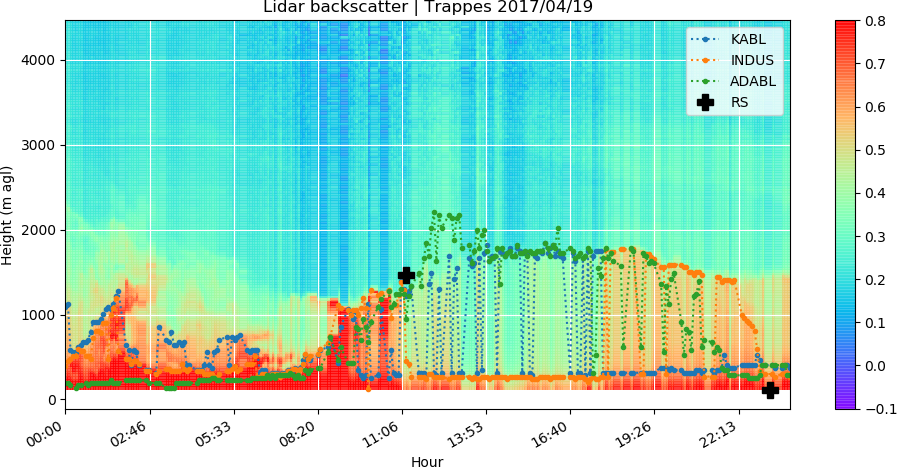
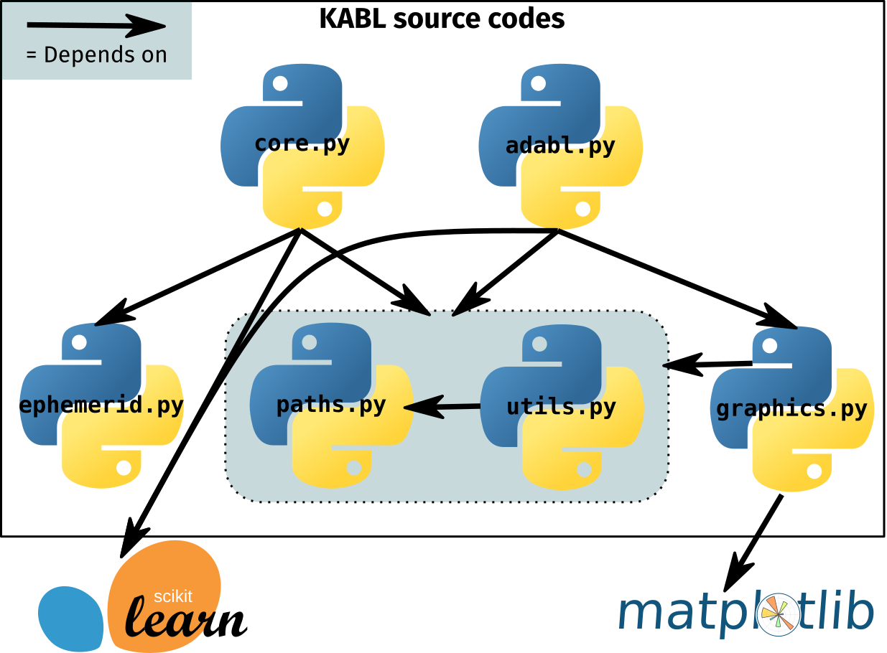
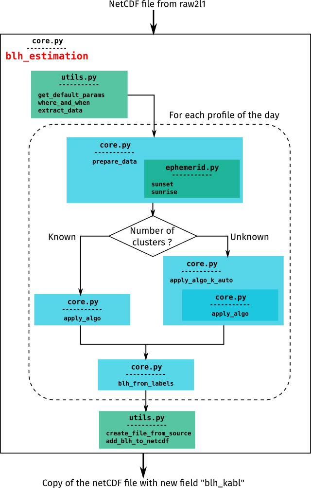
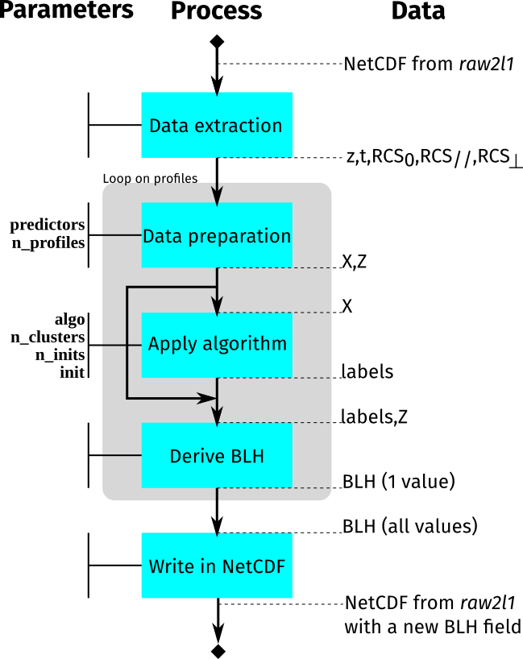

KABL: Kmeans for Atmospheric Boundary Layer. A program to derive boudary layer height from backscatter profile
===========================================================

What is KABL?
--------------
KABL is a free software to derive atmospheric boundary layer height from backscatter profiles measured by aerosol lidars or ceilometers.
It is based on K-means algorithm: it automatically groups the points of the profile and identify one these groups as the boundary layer.



How to use it?
---------------
The KABL package can be installed by following the **installation instructions below**.
Once installed, you will find ready-to-use scripts in the `examples` directory.
They use the data samples given in the directory `data_samples`.


Contacts
---------
This software is edited by Meteo-France.
  * Thomas Rieutord (CNRM) : thomas.rieutord@meteo.fr
  * Sylvain Aubert (DSO) : sylvain.aubert@meteo.fr

Licence
--------
This software is under [CeCILL](https://cecill.info/licences.en.html) licence (open source, French equivalent to GNU/GPL licence).
Terms are in the LICENCE.txt file.

Installation
=============

Installing dependencies
------------------------

### With Conda (recommended)
Conda is a package manager very helpful in Python.
If you do not have `conda`, you can download it [here](https://docs.conda.io/projects/conda/en/latest/index.html).

The advantage of using `conda` the way described here is to isolate the python configuration needed for KABL from the rest your current configuration.

```bash
conda create -n kabltest python=3.7   # Create a new environnement with Python 3.7
conda activate kabltest               # Enter this environment
```

Now the text (kabltest) should appear before your prompt
```
conda install --file requirements.txt
```

### With pip
For an installation with `pip`, follow these instructions:

```bash
pip install -r requirements.txt 
```

Installing the KABL package
---------------------------
This can be done only with `pip`.
In the directory where is the `setup.py`, run:
```bash
pip install -e .
```

Use KABL
---------
Once the installation is ready (prompt should display `(kabltest)` if you are using conda), you can execute the ready-to-use script in the `examples` directory:
```bash
python try_kabl_and_adabl.py
```
More information about the package and its parameters are given below.

The package
============

Description
---------------

KABL package is located in the `kabl` directory. It contains 6 Python source codes :
  * `adabl.py`: module containing the core functions of ADABL.
  * `core.py`: module containing the core functions of KABL.
  * `ephemerid.py`: module to calculate sunrise and sunset from position. From [Michel Landers](https://michelanders.blogspot.com/2010/12/calulating-sunrise-and-sunset-in-python.html)
  * `paths.py`: module containing all paths to files and directory, OS-indepedently.
  * `graphics.py`: module containing all graphics.
  * `utils.py`: module containing basic functions used in KABL and in graphics.
They depend on other famous Python packages.
Here is the dependency graph:




The algorithm
------------------
As input, KABL takes daily backscatter profiles processed by [raw2l1](https://gitlab.in2p3.fr/ipsl/sirta/raw2l1) software.
As output, it gives the time series of BLH over the day.
By default, it writes it into the same netcdf file as the input.
To perform the BLH estimation over one day (as shown in example), the previous functions are used in the following flowchart:



Tunable parameters
------------------
The script `try_kabl_and_adabl.py` contains a dictionary named `params`.
This dictionary controls all the tunable settings for KABL.
The significations of these settings, as well as their possible values, are explained in the paper associated to this directory (Rieutord et al., 2020).
You also access them in the docstring of `utils.get_default_params()`:
```python
from kabl import utils
help(utils.get_default_params)
```
Parameters are used at several moment in flowchart, as explained in the following figure:


